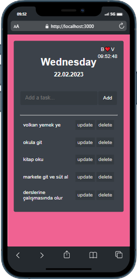

# React todo :

### Proje özeti :

> Proje React ile yazıldı temel amaç task eklemek

### Proje durumu ve yapılacaklar :

- [x] task ekleme
- [x] task silme
- [x] task güncelleme
- [x] tarihi ve saati gösterme
- [x] responsive tasarım
- [x] github page ile yayınlama
- [x] task pasif yapma
- [x] taskları localstorage ya da json serverda tutma

### Projede kullanılan Teknolojiler ve Metotlar :

> Projede useState, useEffect hook kullanıldı.
> stilendirme için herhangi bir kütüphane kullanılmadı pure css ile stilendirme yapıldı.
> gh-pages kullanıldı.
> context api kullanıldı.

### proje font ve renk:

(font-family: "Haas Grot Text R Web", "Helvetica Neue", Helvetica, Arial,
sans-serif;)
(body background-color: #f06292;)
(card background-color: #3c424a;)
(genel color: #f5f5f5;)

### Proje Adresi

[todo](https://dogruvolkan.github.io/todo/)

### Projenin Görselleri:

